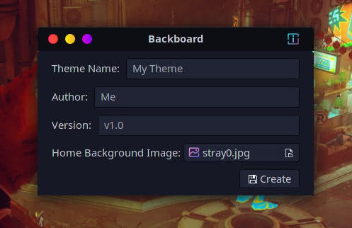
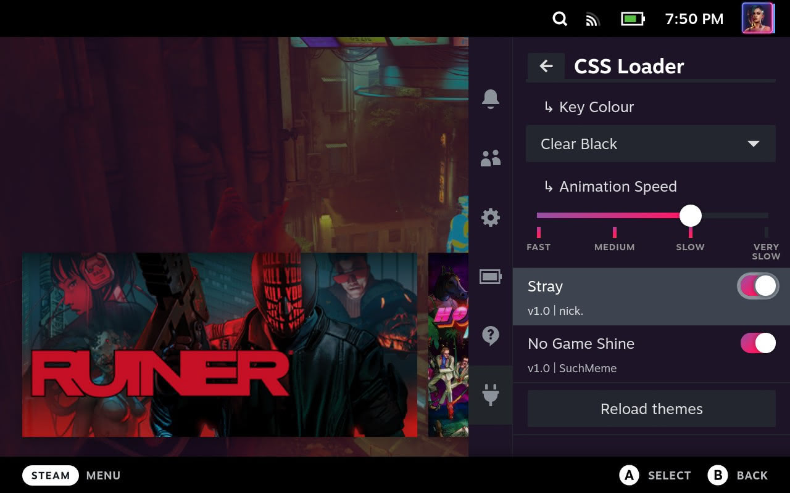
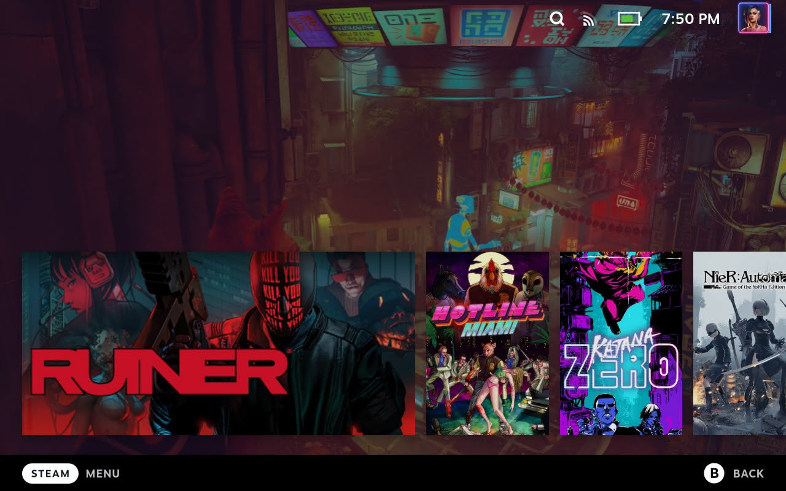

# Backboard
 A tool for quickly creating a basic background theme for the Steam Deck.

This tool will encode the image of your choosing using base64 in order to put it directly into a CSS file for the [CSS Loader](https://github.com/suchmememanyskill/SDH-CssLoader) [Decky](https://github.com/SteamDeckHomebrew/decky-loader) plugin. This means your theme will not depend on a web connection or a static URL.

This tool is only intended to be used directly on the Steam Deck while in Desktop Mode. It does not alter any system files, so it shouldn't pose any problems, but do not expect it to work in any other environment.

Note: you must install [Decky](https://github.com/SteamDeckHomebrew/decky-loader#installation) and [CSS Loader](https://github.com/suchmememanyskill/SDH-CssLoader#installation).

### [Install Backboard!](https://gitlab.com/nickgirga/steam-deck-backboard/-/raw/main/tools/releases/v1.0/install_backboard.desktop?inline=false)

Note: The installer requires an internet connection.

Need help? Check the [Wiki](https://gitlab.com/nickgirga/steam-deck-backboard/-/wikis/Home) for more information!

## Screenshots

# Thanks to These Projects and Their Contributors
 - [Decky](https://github.com/SteamDeckHomebrew/decky-loader)
 - [CSS Loader](https://github.com/suchmememanyskill/SDH-CssLoader)
 - [Steam Deck Themes](https://github.com/suchmememanyskill/Steam-Deck-Themes)
 - [Python](https://www.python.org)
 - [GTK](https://www.gtk.org)
 - [PyGObject](https://gitlab.gnome.org/GNOME/pygobject)
 - [SteamOS](https://store.steampowered.com/steamos)
 - [Steam Deck](https://store.steampowered.com/steamdeck)
 - [Linux](https://github.com/torvalds/linux)
